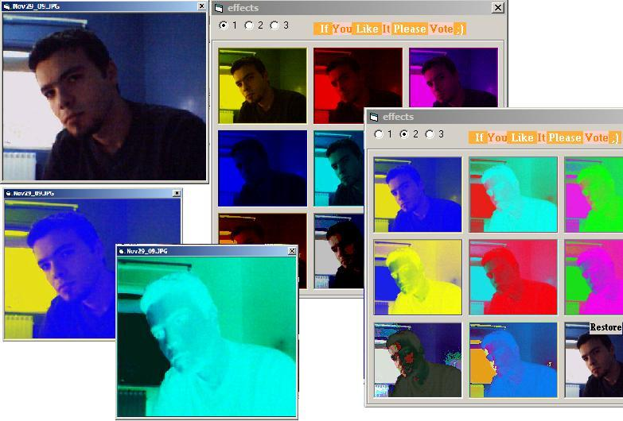



## Grate Picture Effects

### Description

Grate Effects That changes the picture Colors

and make it diffrent You Must see the screenshot!!!

---No API or OCX Its easy code---

If You Like It Please Vote.
 
### More Info
 

             |
---                |---
**Submitted On**   |2002-11-26 18:48:04
**By**             |[Ahmad Mami](https://github.com/Planet-Source-Code/PSCIndex/blob/master/ByAuthor/ahmad-mami.md)
**Level**          |Intermediate
**User Rating**    |4.6 (55 globes from 12 users)
**Compatibility**  |VB 6\.0
**Category**       |[Graphics](https://github.com/Planet-Source-Code/PSCIndex/blob/master/ByCategory/graphics__1-46.md)
**World**          |[Visual Basic](https://github.com/Planet-Source-Code/PSCIndex/blob/master/ByWorld/visual-basic.md)
**Archive File**   |[Grate\_Pict15040411262002\.zip](https://github.com/Planet-Source-Code/ahmad-mami-grate-picture-effects__1-41076/archive/master.zip)

